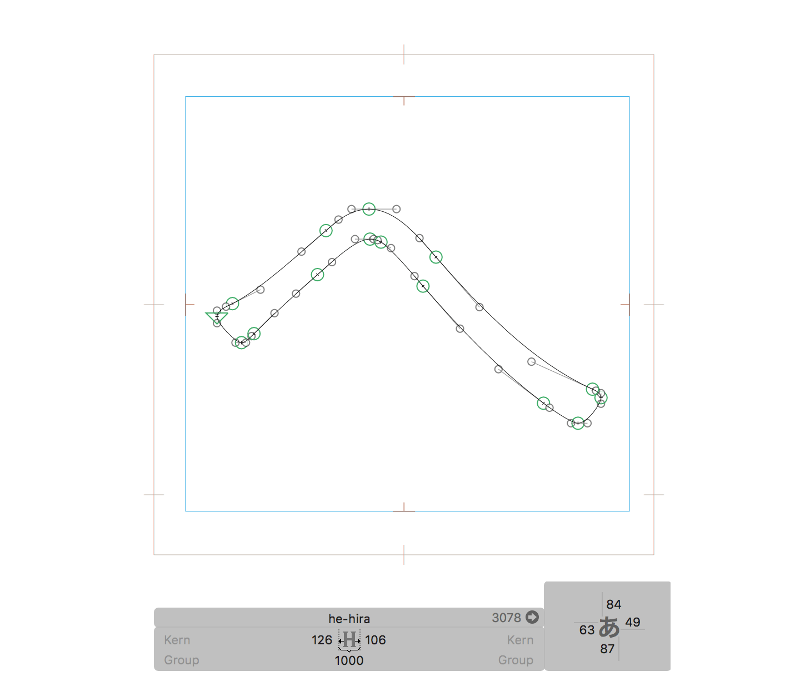
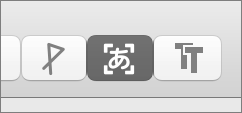
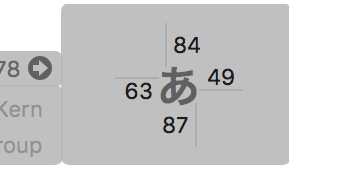

# CJKAnchorPlacement.glyphsTool

A Glyphs tool plugin that allows you to edit LSB/RSB/TSB/BSB anchors rather intuitively.



## Installation

1. Download the ZIP archive and unpack it, or clone the repository.
2. Double-click the `CJKAnchorPlacement.glyphsTool` in the Finder. Confirm the dialog that appears in Glyphs.
3. Restart Glyphs.

## Usage

1. Select the icon on the toolbar to activate the tool.
3. Enter coordinate values directly into the text fields shown at the bottom of the window.
4. Press up and down arrow keys to increment/decrement values.

###### Toolbar Icon



###### Inspector View



## Tips

By default, the shortcut for this tool is set to the `N` key. If you want to customise it, run the following command in the Terminal:

```
$ defaults write com.GeorgSeifert.Glyphs2 CJKAnchorPlacementTool.Hotkey 'j'
```

Make sure to enter the key name you want in lowercase. To reset the shortcut to default, run the following:

```
$ defaults delete com.GeorgSeifert.Glyphs2 CJKAnchorPlacementTool.Hotkey
```

## Requirements

Tested with Glyphs 2.3 on OS X 10.11 and Glyphs 3.1.1 on macOS 10.15.7.

## License

Apache License 2.0
